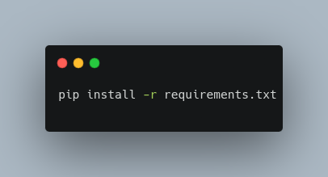
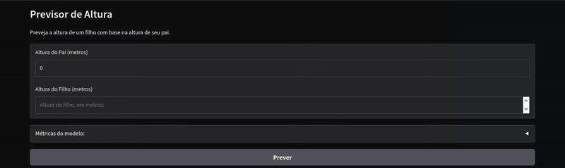

#  Previsor de altura
  

> Baseado no dataset do [Pearson Height Experiment](https://www.kaggle.com/datasets/fundal/pearsons-height-data-simple-linear-regression)
>> Modificações feitas: conversão de medidas de polegadas para metros.
---

## O que é este projeto?
Uma aplicação interativa que usa um modelo de regressão linear para prever a altura de um filho com base na altura de seu pai.

## Demo
Este projeto possui uma versão interativa: 

## Requisitos
- Todos os requisitos estão presentes no 'requirements.txt', que podem ser adicionados com o 'pip':

## Uso
